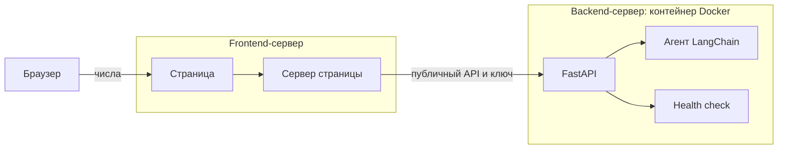

# Агент на LangChain

Агент умножает от 2 до 5 чисел: целые или дроби не длиннее трёх знаков после запятой. Считать можно в терминале или через HTTP. Страница для браузера принимает числа у себя и уже сама вызывает сервис, поэтому ключ доступа в браузер не попадает.

## Архитектура

Проект разделён на два сервера.

1. **Frontend-сервер** показывает страницу. Пользователь вводит от двух до пяти чисел, нажимает «Умножить» и видит произведение.
2. На **Frontend-сервере** числа не перемножаются. Он отправляет их на **Backend-сервер**, где работает агент LangChain из `main.py`.
3. Поверх агента на **Backend-сервере** стоит слой FastAPI.
4. Этот слой асинхронный: запрос не блокирует остальные обращения, пока агент считает.
5. Агент, FastAPI и их зависимости на **Backend-сервере** собраны в одном контейнере Docker.
6. Связь идёт через публичный API. Браузер обращается только к странице **Frontend-сервера**. Уже **Frontend-сервер** вызывает FastAPI и передаёт ключ доступа. Одного адреса недостаточно: без верного ключа **Backend-сервер** отвечает `401`.
7. В сервис встроен health check: `GET /` отвечает `{"status": "up"}`, `GET /health` — `{"status": "ok"}`. Эти проверки ключ не требуют.



## Frontend-сервер

### Что нужно

- Python 3.10 или новее: страница использует стандартную библиотеку
- обратный прокси с HTTPS, пример есть в `catalog/Caddyfile`
- адрес Backend-сервера, ключ доступа и идентификатор сценария

### Установка

Файлы страницы лежат в каталоге `catalog`. Отдельное окружение и `requirements.txt` для неё не нужны.

### Настройка

Адреса серверов, IP и пароли в репозиторий не входят. Файл `.env` тоже.

На этой машине нужны ключ доступа, идентификатор сценария и адрес сервиса:

```env
LANGFLOW_URL="https://адрес-сервиса"
LANGFLOW_API_KEY="ваш_ключ_доступа"
LANGFLOW_FLOW_ID="идентификатор_сценария"
```

Ключ OpenAI здесь не используется.

### Запуск в терминале

```bash
python3 catalog/app.py
```

Приложение слушает `127.0.0.1:8080`. Диалог с агентом на этом сервере не запускается.

### HTTP-сервис

Сервер страницы сам отправляет на Backend-сервер запрос `POST /api/v1/run/{LANGFLOW_FLOW_ID}` и подставляет ключ доступа. Браузер этот запрос не видит.

### Страница

В каталоге `catalog` — поля множителей и кнопка «Умножить». Пользователь вводит от двух до пяти чисел и видит произведение. В `catalog/Caddyfile` указан пример адреса, не боевой домен.

### Состав

- `catalog/` — страница, приложение и пример настройки HTTPS
- `.env` — адрес сервиса, ключ доступа и идентификатор сценария, только на машине

## Backend-сервер

### Что нужно

- Python 3.12
- [uv](https://docs.astral.sh/uv/) или обычный `venv`
- Docker, чтобы запустить сервис в контейнере
- ключ OpenAI

### Установка

```bash
uv venv --python 3.12 .venv
uv pip install --python .venv/bin/python -r requirements.txt
```

Образ контейнера:

```bash
docker build -t multiply-api .
```

### Настройка

Создайте `.env` в корне проекта. В репозиторий его класть не нужно.

```env
key_openai="ваш_ключ"
model_openai="gpt-4o-mini"
LANGFLOW_API_KEY="ваш_ключ_доступа"
LANGFLOW_FLOW_ID="идентификатор_сценария"
```

Ключ OpenAI остаётся только здесь. В контейнер эти значения передаются при запуске и в образ не входят.

### Запуск в терминале

```bash
.venv/bin/python main.py
```

Примеры запросов:

- `Сколько будет 7 умножить на 8?`
- `Умножь 1.125, 2 и -0.5`

Выход из диалога: `exit` или `quit`.

### HTTP-сервис

```bash
.venv/bin/uvicorn main:app --host 127.0.0.1 --port 8000
```

Запрос:

```http
POST /api/v1/run/{LANGFLOW_FLOW_ID}
X-API-Key: ваш_ключ_доступа
```

```json
{"numbers": ["1.125", "2", "-1"]}
```

Ответ содержит полное произведение и текст агента. Без верного ключа сервис отвечает `401`. Проверки `GET /` и `GET /health` ключ не требуют.

### Страница

Страницу этот сервер не отдаёт. Он принимает числа от Frontend-сервера и возвращает произведение.

### Состав

- `main.py` — агент, инструмент умножения и HTTP-сервис
- `requirements.txt` — зависимости
- `Dockerfile` — образ сервиса
- `.env` — ключ OpenAI, ключ доступа и идентификатор сценария, только на машине
